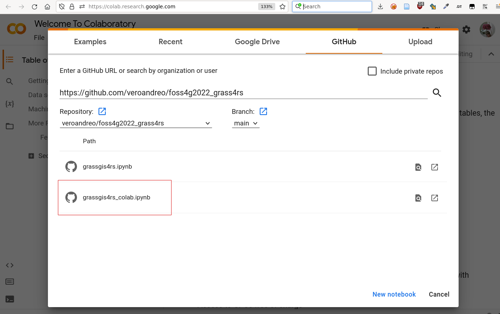

# [GRASS GIS for remote sensing data processing and analysis ](https://talks.osgeo.org/foss4g-2022-workshops/talk/NCMHSM/)

This repo holds the Jupyter notebook that will be used for the **GRASS for Remote sensing**
workshop at FOSS4G 2022 in Florence.

We will present and exemplify a subset of GRASS GIS toolsets for satellite imagery
data processing and analysis in combination with other core modules and add-ons in
a workflow going from data download to supervised classification of different scenes
and visualization of results.

We will start with some basic GRASS concepts, but we'll assume Python and remote
sensing basic knowledge. 

:exclamation: **Participants should install the needed software and download the data in advance**.

If you have problems installing the required software or prefer not to install anything new
on your machine, we are providing a notebook that can be opened and ran in [Google Colab](https://colab.research.google.com/).
You only require to sign-in with a Google account and upload/open the file `grassgis4rs_colab.ipynb`
there.

## Workshop overview

1. Why Jupyter Notebooks and how to use them?
2. GRASS GIS basics
3. GRASS GIS & Python
4. Getting ready: set variables and download sample data
5. Initialization of GRASS GIS in the Jupyter notebook session
6. Creating an area of interest map
7. Importing geodata into GRASS GIS
8. Sentinel-2 processing overview
9. Computing NDVI
10. Time series data processing
11. Creating an image stack (imagery group)
12. Object recognition with image segmentation
13. Supervised Classification: Random Forest
14. Supervised Classification: Maximum Likelihood and band references
14. What's next?

See the `grassgis4rs.ipynb` notebook for details.

## Getting started

Clone this repository with `git clone` first or download the `*.ipynb` file.
Then locally start the Jupyter notebook server from the command line in the
directory containing the `*.ipynb` file with:

`jupyter notebook`

This will open a new browser tab or window with a list of the contents of the current
working directory. Clicking on the `*.ipynb` file will start the notebook.

See also the official documentation for [The Jupyter Notebook](https://jupyter-notebook.readthedocs.io/en/latest/).

## Running the notebook in Google Colab

To open the notebook in [Google Colab](https://colab.research.google.com/), just use the URL 
of this repository:



## Software requirements for running the notebook locally

### GRASS GIS

We will use **GRASS GIS 8.2+**. It can be installed either through standalone
installers/binaries or through [OSGeo-Live](https://live.osgeo.org/en/index.html)
(a Linux based virtual machine which includes all OSGeo software and packages).

##### MS Windows

There are two different options:
1. [OSGeo4W 64-bit](http://download.osgeo.org/osgeo4w/v2/osgeo4w-setup.exe)
2. [Standalone installer 64-bit](https://grass.osgeo.org/grass82/binary/mswindows/native/WinGRASS-8.2.0-1-Setup.exe)

For Windows users, **we strongly recommend installing GRASS GIS through the OSGeo4W package** (first option),
since it allows to install all OSGeo software.

##### Ubuntu Linux

Install GRASS GIS 8.2 from the "unstable" package repository:

```
sudo add-apt-repository ppa:ubuntugis/ubuntugis-unstable
sudo apt-get update
sudo apt-get install grass grass-gui grass-dev
```

##### Fedora, openSuSe Linux

For other Linux distributions including **Fedora** and **openSuSe**,
simply install GRASS GIS with the respective package manager.
See also [here](https://grass.osgeo.org/download/linux/#GRASS-GIS-current).

##### Mac OS

Have a look at: http://grassmac.wikidot.com/downloads

## Other required Python packages

Please install other required python packages with: 

```
pip3 install sentinelsat notebook folium scikit-learn pandas numpy seaborn matplotlib
```

## Data

Please download the following files in advance:

- North Carolina (NC) sample data: https://grass.osgeo.org/sampledata/north_carolina/nc_spm_08_grass7.zip
- Sentinel-2 scenes: https://data.neteler.org/foss4g2022/sentinel.zip
- NC NLCD 2019 map in GRASS GIS format: https://data.neteler.org/foss4g2022/nc_nlcd2019.pack

## Registration at Copernicus Open Access Hub

We'll use Sentinel-2 data and hence users must be registered at the
[Copernicus Open Access Hub](https://scihub.copernicus.eu/).
Fill in the form [here](https://scihub.copernicus.eu/dhus/#/self-registration)
and create a text file with two lines including `username` and `password`,
such as:
```
username
password
```

## Lecturers

- [Veronica Andreo](https://veroandreo.gitlab.io/) holds a PhD in Biology and an MSc in Remote Sensing and GIS Applications. She is a researcher for CONICET working at the Argentinian Space Agency. Her main interests are remote sensing and GIS tools for disease ecology research and applications. She is part of the GRASS Dev Team, currently serving as PSC chair.
- [Markus Neteler](https://www.mundialis.de/neteler/), PhD, is a cofounder of mundialis after having spent 15 years as a researcher in Italy. His focus is on Earth Observation, GIS and cloud computing. Markus managed the GRASS GIS project for two decades, and he is a founding member of OSGeo and other organizations.
- Māris Nartišs is a geographer with more than ten years of experience in teaching topics related to GIS, remote sensing and geomorphology. A free software supporter, and GRASS GIS contributor.
